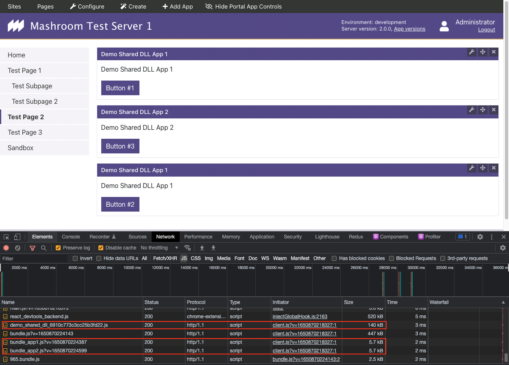

# Mashroom Demo Shared Web DLL

Demo for [Mashroom Server](https://www.mashroom-server.com) that shows how to share vendor modules (e.g. React) between multiple 
Portal Apps (Microfrontends).

It uses the *webpack* [DLL Plugin](https://webpack.js.org/plugins/dll-plugin) together with the *globalResource* mechanism 
of *Mashroom Portal* and the [Mashroom DLL Webpack Plugin](https://github.com/nonblocking/mashroom-dll-webpack-plugin)

## Usage

 1. Setup

    npm run setup
    npm run build
    
 2. Install [Mashroom Portal Quickstart](https://github.com/nonblocking/mashroom-portal-quickstart)      
 3. Add the full path to the *packages/* folder in this repo to *pluginPackageFolders* in *config/development/mashroom.json*
 4. Start the Portal and open http://localhost:5050/portal
 5. On any Portal page add the Apps *Demo Shared DLL App 1* and *Demo Shared DLL APP 2* 
 
You will see that the Buttons are numbered across the two apps since the use the same *NumberedButton* React component
in the *demo-ui-library* component.

Also, you can see that the App bundles are really tiny, since they don't contain any vendor libraries:

